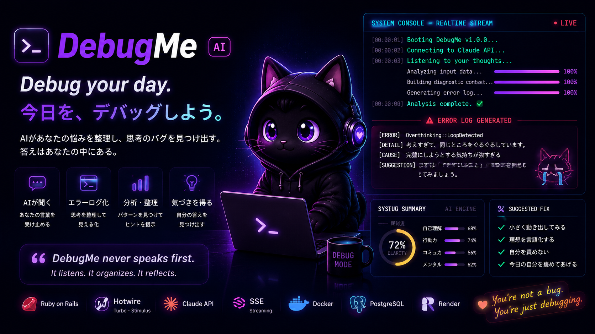
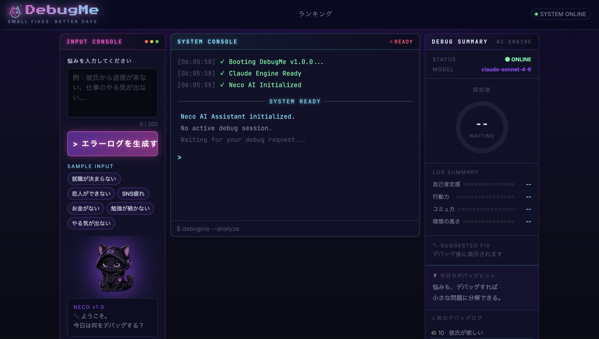
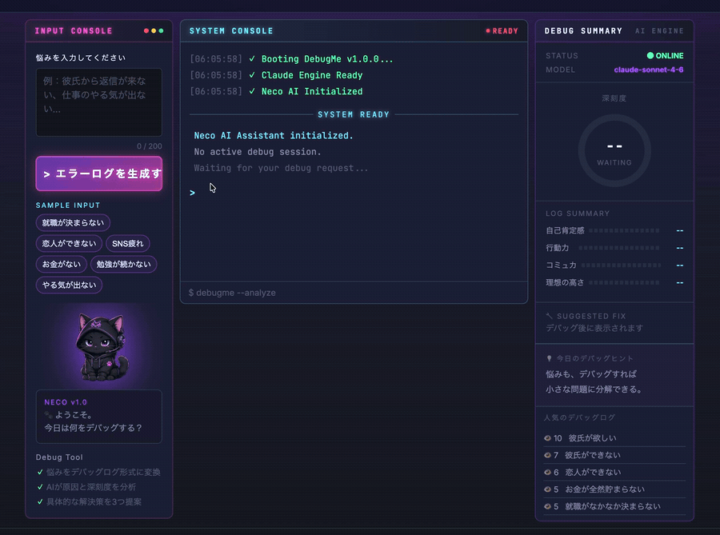
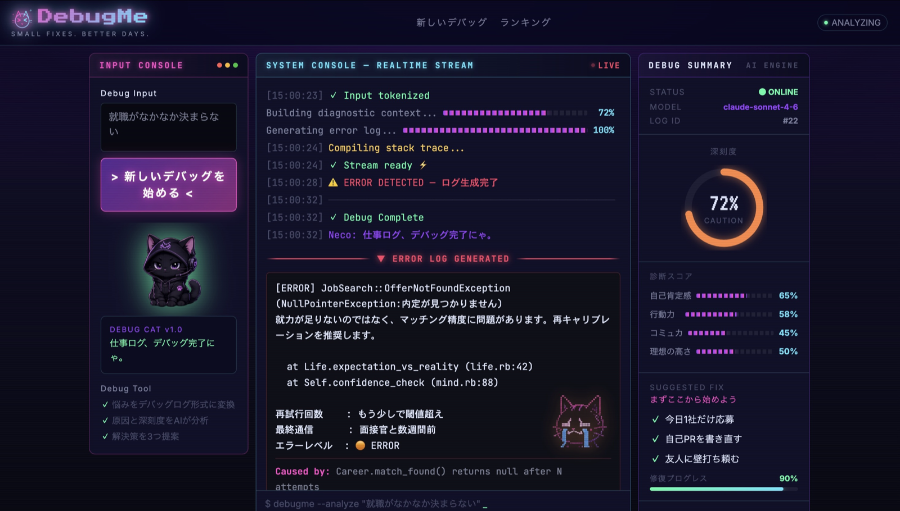
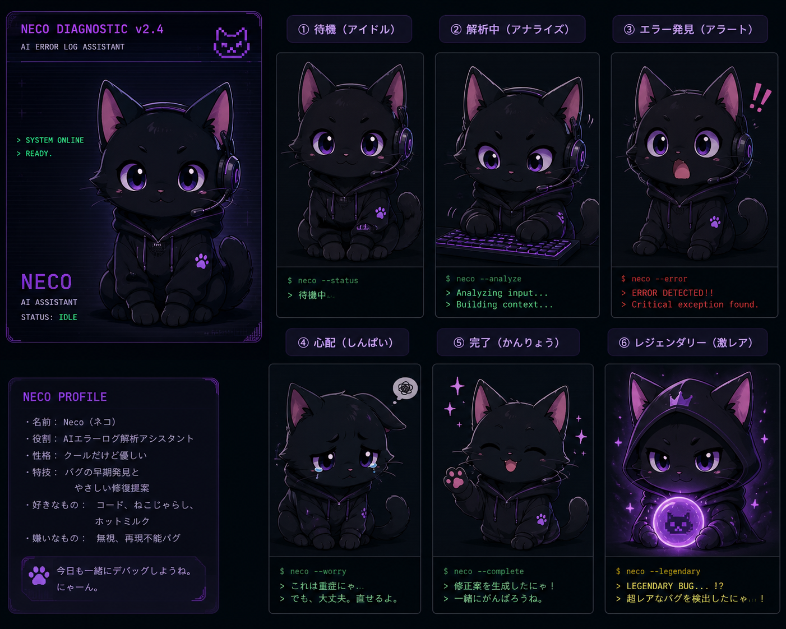
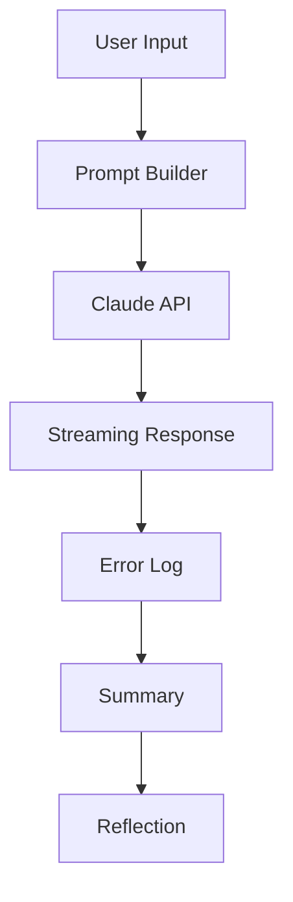

# DebugMe

<p align="center">
  
</p>

> **Debug your day.**
> AI-powered thought debugging.

---

*DebugMe never speaks first.*
*It listens. It organizes. It reflects.*
*AI should support. Users should decide.*

---

## What is DebugMe?

DebugMe is not an AI counselor.
It helps you organize your own thoughts.

Inspired by rubber duck debugging — the idea that explaining a problem out loud helps you find the answer yourself — DebugMe gives that experience a structure. You write. AI listens. You decide.

---

DebugMeは相談AIではありません。
思考を整理するためのデバッグツールです。

プログラマーが使うラバーダックデバッグにインスピレーションを受けた、思考整理ツールです。
AIは裏方。答えを出すのはあなた自身。

---

## Demo

**1. Waiting** — Neco is ready, but never speaks first.



**2. Streaming** — your worry is analyzed in real time.



**3. Result** — your worry, debugged.



*Input → Streaming → Log → Summary → Reflect*

---

## 🐈 Meet Neco

<p align="center">
  
</p>

> *"DebugMe never speaks first."*

Neco is DebugMe's AI companion.

Instead of giving immediate answers,
Neco listens, organizes your thoughts,
and helps you discover your own next step.

---

### Character Profile

| | |
|---|---|
| **Name** | Neco |
| **Role** | AI Error Log Assistant |
| **Personality** | Quiet but kind |
| **Special Skill** | Finding hidden bugs in thoughts |
| **Likes** | Coffee · Listening · Debugging |
| **Dislikes** | Being ignored · Undefined variables · Infinite loops |
| **Motto** | *"Let's debug today together. にゃーん。"* |

---

## Features

- ✅ AI-powered Thought Debugging
- ✅ Streaming Response
- ✅ AI Summary
- ✅ Reflection Support
- ✅ Prompt Engineering
- ✅ Claude API
- ✅ Server-Sent Events
- ✅ Markdown Rendering

---

## Tech Stack

| Layer | Technology |
|---|---|
| Backend | Ruby on Rails |
| Frontend | Hotwire (Turbo + Stimulus) |
| AI | Claude API |
| Streaming | Server-Sent Events |
| Database | PostgreSQL |
| Infrastructure | Docker · Render |

---

## Architecture



---

## Why I Built This

AI services that generate answers are everywhere.

But I wanted to build something different — an experience where AI supports the user's thinking, not replaces it.

Most AI tools speak first. They suggest. They advise. They answer before you've finished thinking.

DebugMe does none of that.

It listens. It organizes. It reflects back what you said — so you can see your own thoughts more clearly.

> *DebugMe never speaks first.*

The user is always the protagonist. AI is the tool.

This isn't just a product decision. It's a design philosophy I want to carry across everything I build.

RewardMe shows what an experience can feel like.
FrameLens shows what an algorithm can look like.
DebugMe shows what AI *shouldn't* do — and why that restraint matters.

---

## Roadmap

- [ ] GitHub Login
- [ ] Personal Debug History
- [ ] AI Memory — Neco remembers your past logs
- [ ] Weekly Reflection — look back on your week
- [ ] Mood Timeline — visualize how you've changed
- [ ] Multiple AI Models
- [ ] Share Debug Log

---

## Setup

```bash
bundle install
rails db:create db:migrate
cp .env.example .env
# Set ANTHROPIC_API_KEY
rails s
```

## Environment Variables

| Key | Description |
|---|---|
| `ANTHROPIC_API_KEY` | Anthropic API key |
| `RAILS_MASTER_KEY` | Rails credentials master key |
| `DATABASE_URL` | PostgreSQL URL (production) |
| `REDIS_URL` | Redis URL |

---

MIT License · Made by [MIZE](https://github.com/mize1978)

---

🐈 Thanks for visiting.

Remember,

> *"You are not a bug.*
> *You're just debugging."*
